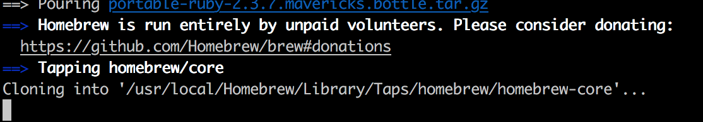

::: tip 概述
对于前端开发而言，鉴于Node.js及一些三方依赖包在Windows环境下有兼容性坑，因此macOS无疑是最佳选择。
:::

## brew
::: tip
官网的命令是:`/bin/bash -c "$(curl -fsSL https://raw.githubusercontent.com/Homebrew/install/master/install.sh)"`

正常情况下，`https://raw.githubusercontent.com`这个域名会被墙，但是如果你有科学上网就可以用端口代理的是方式来处理这个网址：`export ALL_PROXY=socks5://127.0.0.1:1086`

这里的1086是小飞机的端口，这样拉取这个文件就走代理了。
:::
或者用更传统的方法：
* 第一步，获取install文件
把官网给的脚本拿下来，将下面这个地址的`install.sh`下载到本地，并且将权限改为777：`sudo chmod 777 install.sh`，然后执行.sh文件:`./install.sh`
* 第二步，更改脚本中的资源链接，替换成清华大学的镜像
就是把这两句<br/>
`BREW_REPO = “https://github.com/Homebrew/brew“.freeze`<br/>
`CORE_TAP_REPO = “https://github.com/Homebrew/homebrew-core“.freeze` <br/>
更改为这两句 <br/>
`BREW_REPO = “https://mirrors.ustc.edu.cn/brew.git “.freeze`<br/>
`CORE_TAP_REPO = “https://mirrors.ustc.edu.cn/homebrew-core.git“.freeze`<br/>
当然如果这个镜像有问题的话，可以换成别的

* 第三步，执行脚本
`/usr/bin/ruby brew_install`

但是我用的时候没有找到CORE_TAP_REPO，会出现以下情况，有耐心，多等会。

在安装好后，确认brew的安装，在终端中运行`brew -v`，如果出现两个版本号就证明安装成功。一个是`Homebrew`，一个是`Homebrew/homebrew-core`<br/>
当我们用`brew`安装插件的时候，每次都会自动检查当前brew是不是最新的，所以我们需要替换镜像，我们上面已经找到`BREW_REPO`，所以下面只需执行后两句，替换`homebrew-core`的镜像就可以。
```
cd "$(brew --repo)"

git remote set-url origin https://mirrors.ustc.edu.cn/brew.git

cd "$(brew --repo)/Library/Taps/homebrew/homebrew-core"

git remote set-url origin https://mirrors.ustc.edu.cn/homebrew-core.git
```
## node
可以利用`brew`安装`node`后，`npm xx -g`就不会有权限问题：`brew install node`

如果是官网下载安装包的话，默认是在`/usr/local`，可以用`npm config get prefix`查下，所以需要我们修改文件夹的权限：`sudo chown -R $USER /usr/local/{lib/node_modules,bin,share}`：表示把`/usr/local`下的`lib/node_modules`、`bin`、`share`所有权更改为当前用户，即拥有`root`权限
## Terminal

一个好看又好用的终端，往往可以节省很多工作时间。推荐iTerm2 + oh-my-zsh。

`iterm2: https://www.iterm2.com/`

`oh-my-zsh: https://github.com/robbyrussell/oh-my-zsh`

### theme
Spaceship:https://spaceship-prompt.sh/zh/getting-started/

装完需要在终端启用powerline font

* FiraCode: https://github.com/tonsky/FiraCode
* source-code-pro: https://github.com/adobe-fonts/source-code-pro


#### 个人强烈推荐的插件
**zsh-autosuggestions**
`git clone git://github.com/zsh-users/zsh-autosuggestions $ZSH_CUSTOM/plugins/zsh-autosuggestions`

`vi ~/.zshrc`

`plugins=(git zsh-autosuggestions)`

[ohmyzsh命令提示插件](https://github.com/zsh-users/zsh-autosuggestions/blob/master/INSTALL.md)


* npm:https://github.com/lukechilds/zsh-better-npm-completion
* yarn:https://github.com/chrisands/zsh-yarn-completions


### 终端快捷键
1. 将光标移动到行首：ctrl + a

2. 将光标移动到行尾：ctrl + e

3. 清除屏幕：ctrl + l

4. 搜索以前使用命令：ctrl + r

5. 清除当前行：ctrl + u

6. 清除至当前行尾：ctrl + k

7. 单词为单位移动：option + 方向键

8. CTRL+W：删除光标前一个单词（根据空格识别单词分隔）

9. CTRL+Y：粘贴之前（CTRL+U/K/W）删除的内容

10. ESC+B：光标向左移动一个单词

11. ESC+F：光标向右移动一个单词


## 配置linux的node服务

1. 下载node文件到本地，桌面的文件夹/upload/node-v10.16.2-linux-x64.tar.xz
2. 用scp从本地拷贝到linux，现在linux的/home目录下新建一个文件夹，这里叫groot

```
scp ~/Desktop/upload/node-v10.16.2-linux-x64.tar.xz root@ip:/home/groot
```

如果有端口的话在scp后面加 -P 20000(端口号)
3. 在linux解压，并且安装

```
cd /home/groot
tar -xvf node-v10.16.2-linux-x64.tar.xz // 解压
mv node-v10.16.2-linux-x64 nodejs // 重命名文件夹
ln -s /home/groot/nodejs/bin/npm /usr/local/bin // 将node的二进制文件和linux的二进制文件建立软连接
ln -s /home/groot/nodejs/bin/node /usr/local/bin // 将node的二进制文件和linux的二进制文件建立软连接
node -v // 检查node版本,如果没有报错并且显示出来版本号说明成功了
```


### 小飞机终端代理
`vi ~/.zshrc`添加

```js
alias setproxy="export ALL_PROXY=socks5://127.0.0.1:1086"
alias unsetproxy="unset ALL_PROXY"
```

`127.0.0.1:1086`中的1086是小飞机的本地Socks5的监听端口

### Nginx反向代理
`brew nginx`

`vi /usr/local/etc/nginx/nginx.config`进行配置更改，也可以在`/usr/local/etc/nginx/servers`里面添加配置

```js
server{
    listen 80;
    server_name *.qa.91jkys.com;
    access_log /var/log/nginx/zhiyun_access.log;
    error_log  /var/log/nginx/zhiyun_error.log;

    if ($http_host ~* "^(.*?)\.qa\.91jkys\.com$") {
        set $domain $1;
    }

    location / {
        if ($domain ~* "trycatch") {
            proxy_pass http://127.0.0.1:3000;
        }
        if ($domain ~* "operate-admin") {
            proxy_pass http://127.0.0.1:1024;
        }
        if ($domain ~* "metabase-admin") {
            proxy_pass http://127.0.0.1:1025;
        }
        if ($domain ~* "supply"){
            proxy_pass http://127.0.0.1:9999;
        }
        proxy_redirect     off;
        proxy_set_header   Host             $http_host;
        proxy_set_header   X-Real-IP        $remote_addr;
        proxy_set_header   X-Forwarded-Proto $scheme;
        proxy_set_header   X-Forwarded-For  $proxy_add_x_forwarded_for;
    }
}
```

启动Nginx` brew services start nginx`
重启Nginx` brew services restart nginx`
暂停Nginx` brew services stop nginx`

