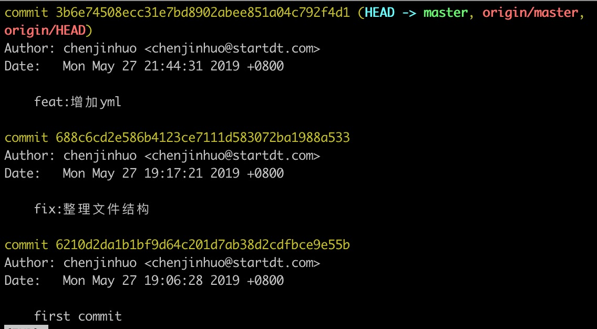
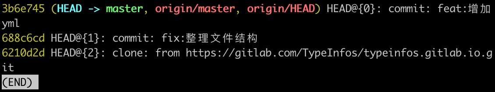

::: tip
Git和其他版本控制系统如SVN的一个不同之处就是有暂存区的概念。这边记录的是Git的一些笔记
:::
<!-- more -->


## 工作区和暂存区
::: tip
Git和其他版本控制系统如SVN的一个不同之处就是有暂存区的概念。
:::
### 暂存操作
:::
list相当于是一个数组，数组下标对应的内容就是存着你每次暂存的信息.
:::
* 暂存操作
`git stash save '本次暂存的名称'`
* 查看记录
`git stash list`
 会出现以下信息
 ```
 stash@{0}: On master: test

 stash@{下标从0开始} On 分支：你填入暂存的名称
 ```
* 恢复暂存的工作
pop命令恢复,恢复后,暂存区域会删除当前的记录
`git stash pop stash@{index}`
apply命令恢复,恢复后,暂存区域会保留当前的记录
`git stash apply stash@{index}`

* 删除暂存
删除某个暂存，删之后你就取不了这个下标的信息了
`git stash drop stash@{index}`
删除全部暂存
`git stash clear`

### 版本库
工作区有个隐藏目录`.git`，这个不算工作区，而是Git的版本库。

Git的版本库存了很多东西，其中最重要的就是成为stage（或者叫index）的暂存区，还有Git为我们自动创建的第一个分支master，以及指向master的一个指针叫HEAD。

当我们把文件往Git版本库里添加的时候，是分两步执行的：

第一步是用`git add`把文件添加进去，实际上就是把文件修改添加到暂存区去

第二步是用`git commit`提交更改，实际上就是把暂存区的所有内容提交到当前分支

因为我们创建Git版本库时，Git自动为我们创建了唯一一个master分支，所以，现在，git commit就是往master分支上提交更改。

你可以简单理解为，需要提交的文件修改通通放到暂存区，然后，一次性提交暂存区的所有修改。


## 推送到远程库
正常推送到远程库的流程是
```
git add *
git commit -m 'DESCRIPTION'
git push origin master
```
推荐一个命令：`git commit -am 'DESCRIPTION'`包括`git add *`，上面的两步可以变为一步。<br>

## git push
正常情况下git push的用法如下：
`git push <远程主机名> <本地分支名>  <远程分支名>`<br>
### git push origin master
如果远程分支被省略，如上则表示将本地分支推送到与之存在追踪关系的远程分支（通常两者同名），如果该远程分支不存在，则会被新建
### git push origin
如果当前分支与远程分支存在追踪关系，则本地分支和远程分支都可以省略，将当前分支推送到origin主机的对应分支
`git push origin cjh:cjh`<br>
表示将本地的'cjh'分支push到远程
### git push
如果当前分支只有一个远程分支，那么主机名都可以省略，形如 git push
### git push --set-upstream origin <本地分支名>
当你在本地新建分支时，远程是没有的，这时候需要用上面这个命令来推到远程。
## 新建、切换、删除远程库
* 查看远程库的地址：
`git remote -v`<br>
在这个地址上可以新建、切换、删除分支
* 新建分支
`git branch 'name'`
::: tip 注意
在本地新建分支，是建在本地分支上，远程库是没有这个分支的，当你用上面的命令新建后，用`git branch -r`查下就知道了，所以当你用本地分支push的时候，会报错:`fatal:The current branch 'name' has no upstream branch`，翻译：当前分支'name'没有上游分支，下面就会提示你用`git push --set-upstream origin 'name'`进行设置上游分支并push。
:::
* 查看分支
查看本地分支`git branch` <br>
查看远程分支`git branch -r` <br>
查看所有分支`git branch -a` <br>
* 切换分支
切换本地分支`git checkout 'name'`<br>
切换远程分支`git checkout -b name origin/name`
* 删除分支
删除远程分支`git push origin --delete 'name'`<br>
删除本地分支`git branch -D 'name'`<br>

* 修改远程仓库地址
`git remote set-url origin [url]`

* 删除本地远程仓库地址&添加新的仓库地址
`git remote rm origin`

`git remote add origin [url]`


## 分支合并
从master新建一个分支来新建功能有三个步骤
1. 新建dev分支
`git branch dev`
2. 切换到dev分支
`git checkout dev`
::: tip checkout技巧
以上两部可以换成一部完成，`git checkout -b dev`的作用是：新建dev分支，并切换到dev分支
:::
3. 将master的内容合并到dev分支上
`git merge master`
## git fetch
::: tip
更新远程代码到本地仓库，经常用这个来检测别人是否push上去了没。
:::
## Commit 规范
::: tip Git Commit
Git 每次提交代码，都要写 Commit message（提交说明），否则就不允许提交。

一般来说，Commit message 应该清晰明了，说明本次提交的目的。在多人协作项目中，如果代码风格统一、代码提交信息的说明准确，那么在后期协作以及 Bug 处理时会更加方便。

目前，社区有多种 Commit message 的提交规范。我们推荐使用 Angular 规范，这也是目前使用最广的写法，比较合理和系统化，并且有配套的工具。
:::
用于说明 commit 的类别，只允许使用下面 9 个标识：<br>
* feat：新功能
* fix：修复 bug
* docs：撰写文档
* style：代码格式（不影响代码运行的变动）
* refactor：重构（既不是新增功能，也不是修改 bug 的代码变动）
* test：增加测试
* build：工程化
* example：示例（仅用于修改 example/*）
* chore：代码优化或辅助工具的变动

Commit 信息应符合如下规则，建议使用工具 comitzen(git cz) 代替 git commit 。

`[TYPE](SCOPE):DESCRIPTION#[ISSUE]` <br>
例如： <br>
`feat(button):add type 'ghost' for form usage #666` <br>
* 【可选】SCOPE：用于说明 commit 影响的范围
例如：数据层、控制层 或 button ，视项目不同而不同，一般用于 feat、fix 类型。如果你的修改影响了不止一个 scope ，你可以使用 * 代替。
* 【必填】DESCRIPTION：对 commit 的简短描述
一般不超过 50 个字符，且尽量使用英文，但是我还是用中文。
* 【可选】ISSUE：改动关联的 issue 号码
一般用于 feat、fix ，仅当前 commit 针对某个 issue 时使用。<br>
例如：`fix(login): 修复登录流程的Bug #111`
## git log && git reflog
### git log
可以显示所有提交过的版本信息<br>

如果感觉太繁琐，可以加上参数  --pretty=oneline，只会显示版本号和提交时的备注信息
`git log --pretty=oneline`
这样只会显示版本号和提交时的备注信息
### git reflog
可以查看所有分支的所有操作记录（包括已经被删除的 commit 记录和 reset 的操作）

例如执行 git reset --hard HEAD~1，退回到上一个版本，用`git log`则是看不出来被删除的commit，用`git reflog`则可以看到被删除的commited，我们就可以买后悔药，恢复到被删除的那个版本。
## git reset
`git reset (–mixed) HEAD~1`
回退一个版本,且会将暂存区的内容和本地已提交的内容全部恢复到未暂存的状态,不影响原来本地文件(未提交的也
不受影响)
`git reset –soft HEAD~1`
回退一个版本,不清空暂存区,将已提交的内容恢复到暂存区,不影响原来本地的文件(未提交的也不受影响)

将头指针移指定位置上面（比如向前移动5个commit），但是指针前面的commit内容还是存在的，且这commit的内容还是存在的，在staged change（暂存区）里面，当前如果commit后，在`git push -f`，那么这5个commit就会变成当前一个commit。
`git reset –hard HEAD~1`
回退一个版本,清空暂存区,将已提交的内容的版本恢复到本地,本地的文件也将被恢复的版本替换

将本地的头指针移到指定位置，但是指针前面的commit内容还是存在的，这是需要`git push -f`强制推上去，那些commit就被删除了
## git checkout
在commit层面，`git checkout <branch name>`表示切换至另一个分支，这个命令实际上是将HEAD指向另外一个分支，并且将工作区更新到那个分支。和git reset不同，git checkout不会移动分支。<br>
git checkout也可以指定某个commit，这就像切换一个分支一样：git会将HEAD指向那个commit，形成`detached HEAD`，查了下资料发现这个`detached HEAD`是个临时指向，并没有新建分支，所以并没有什用。这对于快速查看文件旧版本来说非常方便，但如果你当前的HEAD没有任何分支引用，那么这会造成HEAD分离。因此，在为分离的HEAD添加新的提交时候你应该创建一个新的分支。

## git merge
::: tip –no-ff参数的作用
git merge –no-ff 可以保存你之前的分支历史。能够更好的查看 merge历史，以及branch 状态。<br>
git merge 则不会显示 feature，只保留单条分支记录。
:::

## git rebase


## git cherry-pick
用来将其他分支的`commit`拷贝到当前分支

用法：
拷贝单个commit：
`git cherry-pick <commit>`

拷贝多个commit：
`git cherry-pick commitId_1..commitId_2`

注意：`commitId_1`一定要在`commitId_2`前面提交，


### -s ours
假设当前在分支A上

`git merge -s ours B`的结果是，遇到冲突时采用A分支的结果

### -s theirs
假设当前在分支A上

`git merge -s theirs B`的结果是，遇到冲突时采用B分支的结果，没有试验过，猜测是这样的


## git cz
规范提交`commit`的工具，初始化项目指南：[making-your-repo-commitizen-friendly](https://github.com/commitizen/cz-cli#making-your-repo-commitizen-friendly)


