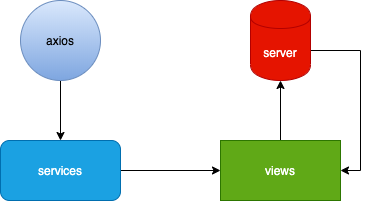
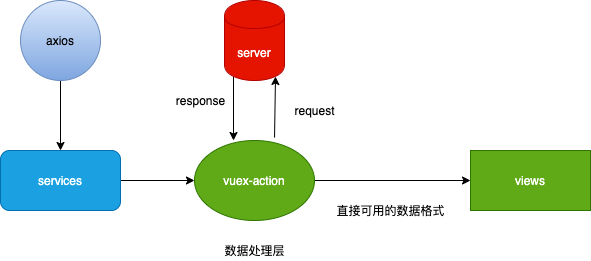

::: tip 项目结构的重要性
高内聚低耦合是衡量软件设计好坏的标准，项目结构也是如此。一个良好的项目架构应该随着项目迭代但目录结构却改变不大并保持着高内聚低耦合的规范。

本文推荐的项目结构实践：[财务后台](https://gitlab.91jkys.com/web/finance-admin/tree/qatest)
:::

<!-- more -->


## 传统Vue项目结构

```js
src
├── components // 全局可复用组件，包含：高复用业务组件、纯样式组件
├── pages // 所有模块的页面.vue文件
├── router // 所有模块的router
├── service // 所有模块的router
├── store // 所有模块的store
```
从上面的目录可以看得出来重复最多的两个词：`全局`和`所有模块`，这就彻底违背了高内聚低耦合的思想，每个文件夹里面的内容都是会被相互引用。

### 持续迭代的问题
1. 比如我现在想在原来代码的基础上加一个模块，必须要在最外层的`pages`、`router`、`store`来回穿梭，甚至有时不小心还改了别的模块的代码，在合并代码时也会出现问题。
2. 当项目不断迭代之后，`pages`、`router`和`store`文件夹下面的文件就不断扩大，当整体代码超过10万行时，让一个刚入职的新人找一个页面对应的`pages`，可能要找半天，找完pages再去`router`里面找，又是半天（夸张手法-_-）。


## 推荐的项目结构
```js
src
├── components // 全局复用组件，包含：高复用业务组件、纯样式组件
├── modules // 所有模块
├── router // router整合
├── store // store整合
```

### modules
::: tip
顾名思义就是模块的意思，
:::
modules里面可以再次细分成modules，比如下面这种结构:
```js
src
 └── modules
     ├── B
     │   ├── mixins // 可选
     │   ├── components // 可选
     │   ├── constant // 可选
     │   ├── store // 必要
     │   ├── services // 必要
     │   ├── views // 必要
     │   └── routes // 必要
     └── A
         └── modules
             ├── A-2
             └── A-1
                 └── modules
                     └── A-1-1
```
上面结构有一种好处，就是不管项目的层级有多复杂，单个模块的文件就在当个文件夹内，不需要去其他模块的文件夹去找，所以基本上所有项目结构都能hold的住。
## 例子对比
### 传统的目录结构
```js
src
 ├── store
 │   ├── index.js
 │   └── modules
 │       └── dynamicManage.js
 ├── service
 │   ├── modules
 │   │   └── dynamicManage.js
 │   └── index.js
 ├── router
 │   ├── index.js
 │   └── modules
 │       └── dynamicManage.js
 └── pages
     └── dynamicManage
         ├── dynamicManage
         │   ├── dynamicManage.vue
         │   ├── edit.vue
         │   ├── copy.vue
         │   ├── components
         │   │   ├── DynamicFormTable.vue
         │   │   └── DynamicForm.vue
         │   └── add.vue
         └── constants
             └── index.js
```
上面的结构是运营后台左侧菜单其中的一个小功能，这种小功能在运营后台至少有10个，这样就会导致pages、services、router、store横向增长，且没有分层级，只有一个文件夹

主要缺点是：

1. 想找指定模块的文件难找
2. 新加功能时需要在最外层多个文件夹中导入文件
### 推荐的目录结构
```js
src
 └── modules
     └── dynamicManage
         ├── constant
         │   └── index.js
         ├── service
         │   └── index.js
         ├── store
         │   └── index.js
         ├── routes
         │   └── index.js
         ├── components
         │   ├── DynamicForm.vue
         │   └── DynamicFormTable.vue
         └── views
             ├── list.vue
             ├── add.vue
             ├── copy.vue
             └── edit.vue
```
上面的例子是将传统的目录改了一版，相对来说找当前模块文件更为简单
## 工作流
### 传统工作流


举个例子：调用删除接口，并弹窗提示：
::: tip index.vue
```js
async function delateBtn(id) {
  const res = await fetchApi.deleteById(id)
     if (res.success) {
       this.$message.success('删除成功');
     }
}
```
:::
上面的例子是在业务代码中判断是否删除成功，然后提示弹窗，其实判断删除是否成功这是数据处理，业务代码只需要`删除成功`的这个字符串就可以了，所以引出下面的工作流。
### 推荐工作流


举个例子：调用删除接口，并弹窗提示：
::: tip store.js
```js
{
  actions: {
    async deleteById(_, payload) {
      const res = await fetchApi.delete()
      if (res.success) {
        return '删除成功'
      }
    }
  }
}
```·
:::
::: tip index.vue
```js
async function delateBtn(id) {
  const msg = await deleteById(id)
  this.$message.success(msg)
}
```
:::
有时候接口返回的数据并不是前端开发想要的，可以在`action`这一层转换一下，然后直接吐给`view`层，这样做的好处是让`view`层的代码更简介，专注于渲染，不去关注数据处理。


