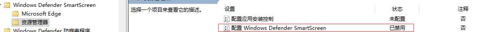
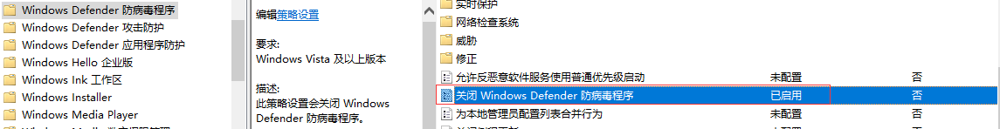
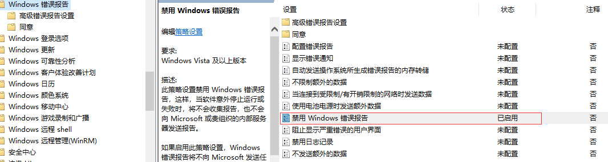
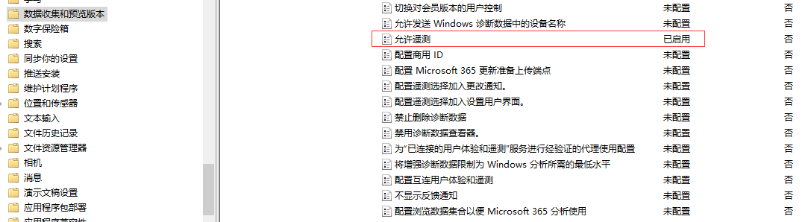
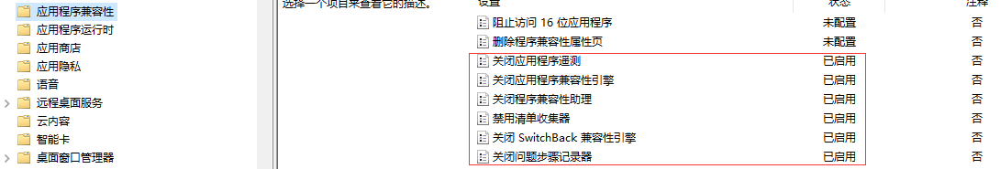
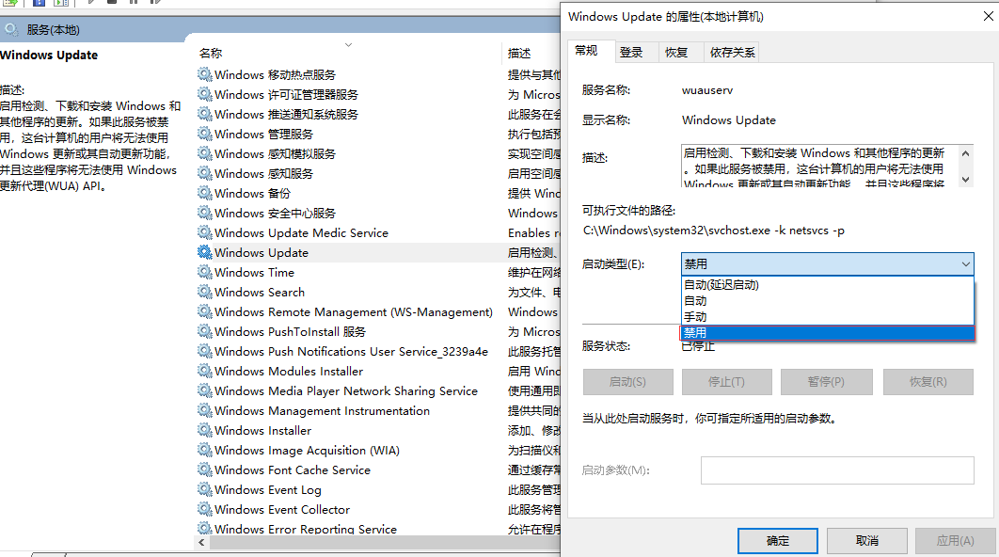
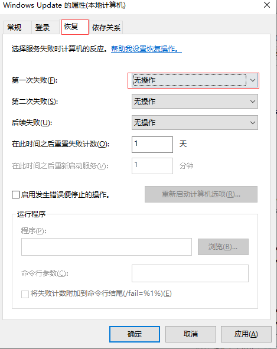
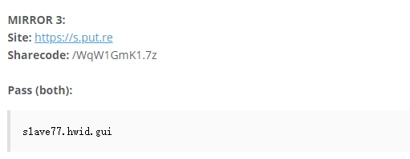

::: tip 概述
每次重装win10后必做的优化，其中包括本地组策略
:::

## 本地组策略

### Windows Defender SmartScreen
1. 

2. 

### Windows Defender 方病毒程序

### window 错误报告

### 数据收集和预览版本

### 应用程序兼容性

## 服务

### 关闭window update
在打开window设置，有个搜索框，输入服务，按下enter，就出现服务弹窗，找到window update，但是这个可能会引起你电脑有一些漏洞没有及时更新，微软会实时推送漏洞更新。
1. 
2. 

## win10 破解

### 网址
[最新破解软件](https://github.com/qqj147258/HWIDGen/blob/master/README.md)

[破解软件](https://www.nsaneforums.com/topic/312871-windows-10-digital-license-hwid-kms38%E2%84%A2-generation/)
打开网址，网页中会出现类似下面图片的内容，把Site和Sharecode的内容拼接起来。

## 镜像下载

### 网址
[window系统](https://msdn.itellyou.cn/)

## U盘启动软件
::: tip
rufus
:::
