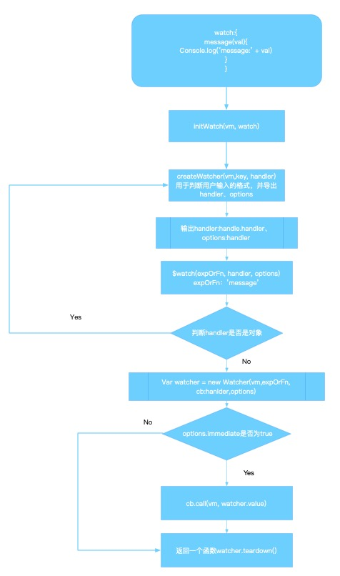

## Vue2.6
::: tip 带着问题看源码
1. message为data中定义的对象，vm._data.message和vm.message有什么区别？
2. 为什么Vue中不能通过索引来修改数组以更新视图？为什么有时候莫名其妙就可以触发视图更新？
3. 为什么只能通过官网指定的几个方法(push、splice...)才能出发数组数据更新？
4. 为什么通过this.$set就可以触发数组下标更新导致更新视图？
5. computed和watch的区别有哪些，computed的缓存是怎么做到的？
6. 怎么样做到更新数据会更新对应的节点，是？
7. 社区经常提到的watcher和dep到底为响应式数据提供了怎么样的逻辑
:::
需要解答上面一系列问题，需要从Vue的_init开始走起。下面得是Vue2.6的源码照搬过来的，基本上每一行都会有注释，但是有一些通过命名就看出来的就没有注释了，可能源码较多，所以我花了流程图，推荐是拿着Vue提供的开发版源码[Vue开发版源码地址](https://cdn.jsdelivr.net/npm/vue/dist/vue.js)，然后在new Vue()断点，慢慢的走一遍，然后再回来看这边文章，可能会解答更多的困惑。
## _init
::: tip
初始化函数，option就是你定义的data、methods、created等等Vue提供的一些属性。
:::
```javascript
Vue.prototype._init = function (options) {
  var vm = this;
  // 做个标记，避免后面被Observer()实例化，因为组件不用观察，需要观察的是数据
  vm._isVue = true;
  {
    // 初始化代理 这边
    initProxy(vm);
  }
  // expose real self
  vm._self = vm;
  initLifecycle(vm);
  initEvents(vm);
  initRender(vm);
  // beforeCreate 函数调用
  callHook(vm, 'beforeCreate');
  initInjections(vm); // resolve injections before data/props
  initState(vm);
  initProvide(vm); // resolve provide after data/props
  // created 函数调用
  callHook(vm, 'created');
  // 查询是否有节点，并挂载到当前节点
  if (vm.$options.el) {
    vm.$mount(vm.$options.el);
  }
};
```
[initProxy]()
[initLifecycle]()
## initProxy
::: tip
首先判断Proxy(<a style="color:rgb(122, 214, 253);" href="#proxy的traps">了解Proxy</a>)是否可用，如果可用就定义`has`或`get`traps放入Proxy，返回给vm._renderProxy。改方法只在开发环境下才会运行，主要是为了检查当前编写的Vue组件是否有错误，如果有就会在控制台报错。
:::
```javascript
    var initProxy = function initProxy (vm) {
      // hasProxy => typeof Proxy !== 'undefined' && isNative(Proxy);
      if (hasProxy) {
        // 决定使用哪个代理handler
        var options = vm.$options;
        var handlers = options.render && options.render._withStripped
          ? getHandler
          : hasHandler;
        vm._renderProxy = new Proxy(vm, handlers);
      } else {
        vm._renderProxy = vm;
      }
    };
  }
```
判断当前环境Proxy是否可用。如果可用就是执行:
```js
vm._renderProxy = new Proxy(vm, handlers);
```
然后看这个`handlers`是啥。

```js
        var handlers = options.render && options.render._withStripped
          ? getHandler
          : hasHandler;
```
上面的`render._withStripped`搜了一下是内部标志，用来正确选择proxy，大部分情况都是undefined，所有`handles`基本都是`hasHandler`
::: tip render._withStripped github issues
This is an internal flag that allows Vue's runtime to pick the correct Proxy strategy to detect variable reference errors during render, depending on whether with has been stripped by vue-template-es2015-compiler.
:::
## getHandler && hasHandler
::: tip
这两种方法主要是为了当用户错误操作vm的属性提示报错。比如调用for in循环遍历vm实例属性时，会触发hasHandler方法，调用vm._data就会触发gethandler方法。
:::
看上面两个对象前先看一个工具函数:
```js
    // allowedGlobals是一个映射表，映射下面列出的类型，
    // allowedGlobals('Infinity') => true
    // allowedGlobals('test') => false
var allowedGlobals = makeMap(
      'Infinity,undefined,NaN,isFinite,isNaN,' +
      'parseFloat,parseInt,decodeURI,decodeURIComponent,encodeURI,encodeURIComponent,' +
      'Math,Number,Date,Array,Object,Boolean,String,RegExp,Map,Set,JSON,Intl,' +
      'require' // for Webpack/Browserify
    );
    // 生成一个map对象和返回一个函数来检查是否含有某个键
  function makeMap (
    str,
    expectsLowerCase
  ) {
    var map = Object.create(null);
    var list = str.split(',');
    for (var i = 0; i < list.length; i++) {
      map[list[i]] = true;
    }
    return expectsLowerCase
      ? function (val) { return map[val.toLowerCase()]; }
      : function (val) { return map[val]; }
  }
```
```js
// 这个对象包含一个方法has，用来拦截HasProperty操作，即判断对象是否具有某个属性时，这个方法会生效。典型的操作就是in运算符。
    var hasHandler = {
      has: function has (target, key) {
        var has = key in target;
        // allowedGlobals('Infinity') => true
        // 当访问的属性是一些js默认定义（allowedGlobals）的类型之一
        // 或者不是string类型且key不是_开头的且属性不在target.$data上返回true
        var isAllowed = allowedGlobals(key) ||
          (typeof key === 'string' && key.charAt(0) === '_' && !(key in target.$data));
          // 如果属性不在target上且没有通过isAllowed判断，就抛出错误提示
        if (!has && !isAllowed) {
          if (key in target.$data) { warnReservedPrefix(target, key); }
          else { warnNonPresent(target, key); }
        }
        return has || !isAllowed
      }
    };
// 针对读取代理对象的某个属性时进行的操作
// 当访问的属性不是string类型或者属性值在被代理的对象不存在，则抛出错误提示，否则就返回该属性值
    var getHandler = {
      get: function get (target, key) {
        if (typeof key === 'string' && !(key in target)) {
          if (key in target.$data) { warnReservedPrefix(target, key); }
          else { warnNonPresent(target, key); }
        }
        return target[key]
      }
    };
```
## proxy的traps
::: tip
proxy所有的traps是可选的。如果某个trap没有定义，那么默认的行为会应用到目标对象上
:::
上面当两个handles处理好后，将要执行`vm._renderProxy = new Proxy(vm, handlers);`，getHandle对应的是get方法，hasHandler对应的是has方法。
* handler.has()<br>
在判断代理对象是否拥有某个属性时触发该操作，比如在执行 "foo" in proxy 时。
* handler.get()<br>
在读取代理对象的某个属性时触发该操作，比如在执行 proxy.foo 时。
## initProxy的流程

## initState
```js
  function initState (vm) {
    // 定义vm的watchers，便于在new Watcher时收集已经实例化的watcher
    vm._watchers = [];
    var opts = vm.$options;
    if (opts.props) { initProps(vm, opts.props); }
    if (opts.methods) { initMethods(vm, opts.methods); }
    if (opts.data) {
    // 继续走initData
      initData(vm);
    } else {
      observe(vm._data = {}, true /* asRootData */);
    }
    if (opts.computed) { initComputed(vm, opts.computed); }
    if (opts.watch && opts.watch !== nativeWatch) {
      initWatch(vm, opts.watch);
    }
  }
```
## initData
::: tip
 初始化data对象，这里面包括定义响应式数据，重点是会新建vm._data属性里面，然后里面放入的是你预定的属性，再将_data的所有属性代理到vm上面，将`vm[key]`代理到`_data[key]`
 下面的流程推荐在源码中断点走一遍，不理解的再回来看看注释。
:::
```js
  function initData (vm) {
    var data = vm.$options.data;
    // 不管是函数还是对象，最终返回的都是纯对象，如果不是纯对象就抛出warn，因为我们只需要data里面预定的属性
    // 并且赋值给vm._data
    data = vm._data = typeof data === 'function'
      ? getData(data, vm) : data || {};
      // getData(data, vm) =>  return data.call(vm, vm)
    if (!isPlainObject(data)) {
      data = {};
      warn();
    }
    var keys = Object.keys(data);
    var props = vm.$options.props;
    var methods = vm.$options.methods;
    var i = keys.length;
    while (i--) {
      var key = keys[i];
      {
        // 判断data的key有没有在prop或methods已经定义过
        if (methods && hasOwn(methods, key)) {
          warn();
        }
      }
      if (props && hasOwn(props, key)) {
        warn();
      } else if (!isReserved(key)) { // isReserved判断字符串是否是$开头,
        // 将vm[key]代理到_data[key]
        // 取vm[key]的值就是取_data[key]的值
        // vm.message  => vm._data.message
        proxy(vm, "_data", key);
      }
    }
    // observe data 观察data
    observe(data, true /* asRootData */);
  }
```
`proxy(vm, "_data", key);`这里的实现很巧妙，点击<a style="color:rgb(122, 214, 253);" href="#proxy">proxy函数</a>跳到函数实现。

`observe(data, true /* asRootData */);`是观察data里面的所有属性，也是开始定义响应式数据的入口点了。点击<a style="color:rgb(122, 214, 253);" href="#observe（判断是否需要观察）">observer</a>函数实现
## initComputed
::: tip initComputed流程
```js
computed:{
  result() {
    return this.message + 'computed'
  }
}
```
假设computed是上面的数据，首先创建不带任何的原型链的空对象赋值到当前vm上`var watchers = vm._computedWatchers = Object.create(null);`，然后遍历computed，跟watch一样，computed也可以是多种写法，经过一系列判断，最终导出set（如果没有就为noop），get函数，然后实例化Watcher，和watch不同的是，是实例化Watcher的时候最后一个参数变成`{ lazy: true }`，这个是缓存的标志，在实例化watcher的过程中并不会执行到`watcher.get`，但是在后续会给当前计算属性`result`设置getter方法，在页面获取值时就会触发getter方法，判断`watcher.dirty`是否是true，如果是的话就执行`watcher.evaluate()`，在`evaluate()`中重新获取`watcher.get()`。可以知道计算属性是通过`watcher.dirty`来判断是否需要重新获取值，在`this.message`更改值时会触发notify，然后执行对应的`watcher.update`，在`update`中`watcher.dirty`变成true。
:::
```js
  function initComputed(vm, computed) {
    // 创建不带任何的原型链的空对象并且挂载到当前组件的实例上
    var watchers = vm._computedWatchers = Object.create(null);
    var isSSR = isServerRendering();

    for (var key in computed) {
      var userDef = computed[key];
      var getter = typeof userDef === 'function' ? userDef : userDef.get;
      if (getter == null) {
        warn(
          ("Getter is missing for computed property \"" + key + "\"."),
          vm
        );
      }

      if (!isSSR) {
        // 针对option.computed中的每个key进行Watcher
        // watcher 用来存储计算值，判断是否需要重新计算
        watchers[key] = new Watcher(
          vm,
          getter || noop, // 用watcher保存getter函数
          noop,
          computedWatcherOptions
          // computedWatcherOptions = { lazy: true };作用是初始化watcher的第一次不执行this.get()，也就是不会获取当前值，只在用到的时候获取
        );
      }
      // 如果key不在vm属性在指定的对象或其原型链中，就执行defineComputed
      if (!(key in vm)) {
        defineComputed(vm, key, userDef);
      } else {
        if (key in vm.$data) {
          warn(("The computed property \"" + key + "\" is already defined in data."), vm);
        } else if (vm.$options.props && key in vm.$options.props) {
          warn(("The computed property \"" + key + "\" is already defined as a prop."), vm);
        }
      }
    }
  }
```
### defineComputed
```js
  function defineComputed(
    target,
    key,
    userDef
  ) {
    var shouldCache = !isServerRendering();
    if (typeof userDef === 'function') {
      sharedPropertyDefinition.get = shouldCache
        ? createComputedGetter(key)
        : createGetterInvoker(userDef);
      sharedPropertyDefinition.set = noop;
    } else {
      // 当计算属性是对象时，判断用户有没有设置set，有的话将用户的set赋值
      sharedPropertyDefinition.get = userDef.get
        ? shouldCache && userDef.cache !== false
          ? createComputedGetter(key)
          : createGetterInvoker(userDef.get)
        : noop;
      sharedPropertyDefinition.set = userDef.set || noop;
    }
    if (sharedPropertyDefinition.set === noop) {
      sharedPropertyDefinition.set = function () {
        warn(
          ("Computed property \"" + key + "\" was assigned to but it has no setter."),
          this
        );
      };
    }
    Object.defineProperty(target, key, sharedPropertyDefinition);
  }
```
### computed流程图


### createComputedGetter
```js
  function createComputedGetter(key) {
    return function computedGetter() {
      // _computedWatchers在Vue
      // this指的是vm，即当前组件实例
      var watcher = this._computedWatchers && this._computedWatchers[key];
      if (watcher) {
        // 缓存控制
        if (watcher.dirty) {
          // 调用evaluate后dirty会变成false
          watcher.evaluate();
          // dep.notice => update() => this.dirty=true
        }
        if (Dep.target) {
          watcher.depend();
        }
        return watcher.value
      }
    }
  }
```
### createGetterInvoker
```js
  function createGetterInvoker(fn) {
    return function computedGetter() {
      return fn.call(this, this)
    }
  }
```


## initWatch
::: tip initWatch流程
```js
watch:{
  message(newVal, oldVal){
    console.log(newVal, oldVal)
  }
}
```
假设`watch`是上面的数据，遍历`key`，由于`watch`可以多种写法，字符串、函数、对象、数组形式，最终导出回调函数，并取到表达式`message`，然后实例化一个`Watcher`，在实例化的过程成中会调用`this.get()`，然后就执行`message`的`getter`，就执行`dep.depend`，依赖就被存储了，然后判断`immediate`是否为`true`，是的话直接执行回调函数。
:::
```js
function initWatch (vm: Component, watch: Object) {
  for (const key in watch) {
    const handler = watch[key]
    // 判断是否是数组，是的话就遍历，可以写成
    // watch: {
    //   message: {
    //     [{
    //       handle: 'init'
    //     },
    //     {
    //       handle: 'init'
    //     }]
    //   }
    // }
    if (Array.isArray(handler)) {
      for (let i = 0; i < handler.length; i++) {
        createWatcher(vm, key, handler[i])
      }
    } else {
      createWatcher(vm, key, handler)
    }
  }
}
```

### createWatcher
```js
function createWatcher (
  vm: Component,
  expOrFn: string | Function,
  handler: any,
  options?: Object
) {
  if (isPlainObject(handler)) {
    options = handler
    handler = handler.handler
  }
  // 说明handle可以传字符串 handle: 'init'，init是method中的一函数
  if (typeof handler === 'string') {
    // 从当前组件中获取属性
    handler = vm[handler]
  }
  return vm.$watch(expOrFn, handler, options)
}
```
### vm.$watch
```js
  Vue.prototype.$watch = function (
    expOrFn: string | Function,
    cb: any,
    options?: Object
  ): Function {
    const vm: Component = this
    if (isPlainObject(cb)) {
      // 如果handle是对象的话就再次执行createWatcher,看下面代码有两个handler，但是效果还是执行执行一次，所以觉得不是很有必要
      // watch:{
      //   message:{
      //     handler: {
      //       handler: 'init',
      //       immediate: true
      //       },
      //     },
      //   },
      return createWatcher(vm, expOrFn, cb, options)
    }
    options = options || {}
    options.user = true
    // 在dep为message的对象中添加订阅，dep.subs添加该watcher
    const watcher = new Watcher(vm, expOrFn, cb, options)
    if (options.immediate) {
      try {
        cb.call(vm, watcher.value)
      } catch (error) {
        handleError(error, vm, `callback for immediate watcher "${watcher.expression}"`)
      }
    }
    return function unwatchFn () {
      watcher.teardown()
    }
  }
}
```

## observe（判断是否需要观察）
::: tip
尝试为value创建一个观察者实例，如果成功就返回新Observer的实例或返回当前已存在Observer
:::
```js
function observe(value, asRootData) {
  // 判断是否是对象 || 这个对象是否是 VNode
  if (!isObject(value) || value instanceof VNode) {
    return
  }
  var ob;
  // 如果这个对象有__ob__属性 && __ob__属性是Observer的实例，就将__ob__赋值给ob
  if (hasOwn(value, '__ob__') && value.__ob__ instanceof Observer) {
    ob = value.__ob__;
  } else if (
    // 如果应该观察 && 不是服务端渲染 && （这个值是个数组 || 这个值是个纯对象）&& 对象是可以扩展的 && value._isVue的值是false(只有根vm._isVue = true)
    shouldObserve &&
    !isServerRendering() &&
    (Array.isArray(value) || isPlainObject(value)) && Object.isExtensible(value) && !value._isVue
  ) {
    ob = new Observer(value);
  }
  return ob
}
```
如果符合上面一系列条件后会跳到Observe进行实例化,点击<a style="color:rgb(122, 214, 253);" href="#observer（观察属性，并替换数组的-proto-）">Observer</a>跳到函数实现。
## defineReactive$$1
::: tip
传入对象和属性名，来设置`defineProperty`的`setter`、`getter`，每次定义前都会new Dep来定义当前数据的Dep，用来保存该数据对应更新user watcher、computed、渲染watcher。
:::
```js
// 声明一个响应式对象
  function defineReactive$$1 (
    obj,
    key,
    val,
    customSetter,
    shallow
  ) {
    // 实例化一个dep
    var dep = new Dep();
    // // 获取对应属性的描述符
    // getOwnPropertyDescriptor
    // {
    //   configurable: Boolean
    //   enumerable: Boolean
    //   value: ''
    //   writable: Boolean
    // }
    var property = Object.getOwnPropertyDescriptor(obj, key);
    if (property && property.configurable === false) {
      return
    }
    // 获取预设定的getter、setter
    var getter = property && property.get;
    var setter = property && property.set;
    // 如果传入参数只有两个，说明没有传val，就调用obj[key]
    if ((!getter || setter) && arguments.length === 2) {
      val = obj[key];
    }
    // shallow表示浅的意思，只在定义 $attrs和$listeners是true，其他都默认为false，便会递归观察对象
    var childOb = !shallow && observe(val);
    Object.defineProperty(obj, key, {
      enumerable: true,
      configurable: true,
      get: function reactiveGetter () {
        // 判断是否有getter，有getter优先调用，在data中定义的是没有getter的
        var value = getter ? getter.call(obj) : val;
        // 在Watcher.get中会触发pushTarget(this);然后将当前的watcher推入全局栈targetStack中，并且将静态变量Dep.target赋值为当前的watcher
        if (Dep.target) {
          dep.depend();
          if (childOb) {
            childOb.dep.depend();
            if (Array.isArray(value)) {
              dependArray(value);
            }
          }
        }
        return value
      },
      set: function reactiveSetter (newVal) {
        var value = getter ? getter.call(obj) : val;
        // 如果旧值和新值全等直接return
        // (newVal !== newVal && value !== value)用来判断 是否是NaN，如果是NaN直接return
        if (newVal === value || (newVal !== newVal && value !== value)) {
          return
        }
        // 如果有自定义setter就执行setter
        if (customSetter) {
          customSetter();
        }
        // #7981: for accessor properties without setter
        if (getter && !setter) { return }
        if (setter) {
          setter.call(obj, newVal);
        } else {
          val = newVal;
        }
        // 如果shallow为undefined或false就把新值扔进observer判断是否需要观察
        childOb = !shallow && observe(newVal);
        // 通知当前dep依赖的watcher更新
        dep.notify();
      }
    });
  }
```
**上面在data里面每个对象挂载了setter、getter方法，但是在之前的proxy也有挂载getter、setter方法，会不会被覆盖呢？**

答案是不会，因为`Object.defineProperty(obj, key)`中虽然key相同，但是obj是不同的，所以两次挂载是不重复，第一次在proxy中设置getter、setter是为了新建一个内存空间来放入getter、setter的值用的，这边是为了截取用户调用data中属性而设置的getter、setter。

如果按照流程走，现在已经走完`initData()`了，返回<a style="color:rgb(122, 214, 253);" href="#initstate">initState</a>继续走<a style="color:rgb(122, 214, 253);" href="#initcomputed">initComputed</a>
## Observer（观察属性，并替换数组的__proto__）
::: tip
附加到每个观察对象的观察者类。一旦附加，观察者将目标对象的属性键转换为`getter/setter`，用于收集依赖项和分配更新。与`Dep`类共同工作才能完成数据更新。
:::
```js
  var Observer = function Observer (value) {
    this.value = value;
    // 实例化一个dep
    this.dep = new Dep();
    this.vmCount = 0;
    // 在value上面添加__ob__这个属性并指向this
    def(value, '__ob__', this);
    if (Array.isArray(value)) {
      if (hasProto) {
        // protoAugment => value.__proto__ = arrayMethods
        // arrayMethods 重点分支，基于Array.__proto__新建一个原型链，然后劫持用户对数组的操作
        protoAugment(value, arrayMethods);
      } else {
        // 忽略
        copyAugment(value, arrayMethods, arrayKeys);
      }
      this.observeArray(value);
    } else {
      this.walk(value);
    }
  };
```
上面用到的函数:
1. <a style="color:rgb(122, 214, 253);" href="#def">def</a>在对象上面添加或修改属性
2. <a style="color:rgb(122, 214, 253);" href="#arraymethods">arrayMethods</a>拦截用户对数组的操作，并且通知这些数据变换依赖的watcher
3. <a style="color:rgb(122, 214, 253);" href="#observearray">Observer.observeArray</a>遍历数组调用observe
4. <a style="color:rgb(122, 214, 253);" href="#walk">Observer.walk</a>遍历对象中所有属性来调用`defineReactive$$1`
### walk
```js
  // 遍历所有属性并将它们转换为getter/setter。此方法只应在值类型为Object时调用。
  Observer.prototype.walk = function walk (obj) {
    var keys = Object.keys(obj);
    for (var i = 0; i < keys.length; i++) {
      defineReactive$$1(obj, keys[i]);
    }
  };
```
`defineReactive$$1()`给对象设置getter、setter，点击<a style="color:rgb(122, 214, 253);" href="#definereactive-1">defineReactive$$1</a>跳转函数实现。

### observeArray
```js
// 遍历数组调用observe
  Observer.prototype.observeArray = function observeArray (items) {
    for (var i = 0, l = items.length; i < l; i++) {
      observe(items[i]);
    }
  };
```
## arrayMethods
::: tip
基于`Array.prototype`新建一个原型链，拦截用户对数组的操作，并且通知这些数据变换依赖的watcher。
:::
```js
    // 获取原生Array中提供的所有方法
  var arrayProto = Array.prototype;
    // 将原生提供的方法创建一个新的对象，以免修改原生的方法，造成全局污染
  var arrayMethods = Object.create(arrayProto);
  var methodsToPatch = [
    'push',
    'pop',
    'shift',
    'unshift',
    'splice',
    'sort',
    'reverse'
  ];
  /**
   * 截取上面这些方法，然后实现相应的操作
   */
  methodsToPatch.forEach(function (method) {
    // 缓存原始方法，也就是Array的原型方法原本的实现
    var original = arrayProto[method];
    def(arrayMethods, method, function mutator () {
      // 截取用户调用Array.methods传入的参数args
      var args = [], len = arguments.length;
      while ( len-- ) args[ len ] = arguments[ len ];
      // 在函数体内优先调用了缓存下来的数组变异方法
      var result = original.apply(this, args);
      var ob = this.__ob__;
      var inserted;
      // 可以看到这个switch里面的方法:push、unshift、splice都是增加数组元素的方法
      switch (method) {
        case 'push':
        case 'unshift':
          inserted = args;
          break
        case 'splice':
          inserted = args.slice(2);
          break
      }
      // // 如果有修改的数据，则添加observer监听器
      if (inserted) { ob.observeArray(inserted); }
      // 通知更新
      ob.dep.notify();
      return result
    });
  });
```
## 公用函数
### setScope
```js
// 给scoped CSS 设置范围id属性
//
    function setScope(vnode) {
      var i;
      if (isDef(i = vnode.fnScopeId)) {
        nodeOps.setStyleScope(vnode.elm, i);
      } else {
        var ancestor = vnode;
        while (ancestor) {
          if (isDef(i = ancestor.context) && isDef(i = i.$options._scopeId)) {
            nodeOps.setStyleScope(vnode.elm, i);
          }
          ancestor = ancestor.parent;
        }
      }
      // for slot content they should also get the scopeId from the host instance.
      if (isDef(i = activeInstance) &&
        i !== vnode.context &&
        i !== vnode.fnContext &&
        isDef(i = i.$options._scopeId)
      ) {
        nodeOps.setStyleScope(vnode.elm, i);
      }
    }
```
### isDef
::: tip 用法与作用
传入一个变量，判断是否是`undefined`且`null`
:::
```js
  function isDef (v) {
    return v !== undefined && v !== null
  }
```
### def
::: tip def
传入`obj, key, val, enumerable`<br>
在对象上面添加或修改属性
:::
```js
/**
 * Define a property.
 */
function def(obj, key, val, enumerable) {
  Object.defineProperty(obj, key, {
    value: val,
    enumerable: !!enumerable,
    writable: true,
    configurable: true
  });
}
```

### traverse
::: tip
递归遍历一个对象来调用所有转换的对象的getter，为了让对象中的每个嵌套属性都被作为一个“深度”依赖。
:::
```js
  function traverse (val) {
    _traverse(val, seenObjects);
    seenObjects.clear();
  }

  function _traverse (val, seen) {
    var i, keys;
    var isA = Array.isArray(val);
    if ((!isA && !isObject(val)) || Object.isFrozen(val) || val instanceof VNode) {
      return
    }
    if (val.__ob__) {
      var depId = val.__ob__.dep.id;
      if (seen.has(depId)) {
        return
      }
      seen.add(depId);
    }
    if (isA) {
      i = val.length;
      while (i--) { _traverse(val[i], seen); }
    } else {
      keys = Object.keys(val);
      i = keys.length;
      while (i--) { _traverse(val[keys[i]], seen); }
    }
  }
```

### hasOwn
::: tip
判断这个对象有没有这个属性
:::
```js
  var hasOwnProperty = Object.prototype.hasOwnProperty;
  function hasOwn (obj, key) {
    return hasOwnProperty.call(obj, key)
  }
```
### shouldObserve
::: tip
在某些情况下，我们可能想要禁止组件中更新计算中的观察。
:::
```js
  var shouldObserve = true;
  function toggleObserving (value) {
    shouldObserve = value;
  }
```
### proxy
::: tip
将target的key属性的值代理到sourceKey中的属性key。结论：取target中的key就是取sourceKey中的key,例如`vm.message = '123'`触发set函数`vm._data.message = '123'`
:::
```js
  var sharedPropertyDefinition = {
    enumerable: true,
    configurable: true,
    get: noop,
    set: noop
  };
  function proxy (target, sourceKey, key) {
    sharedPropertyDefinition.get = function proxyGetter () {
      return this[sourceKey][key]
    };
    sharedPropertyDefinition.set = function proxySetter (val) {
      this[sourceKey][key] = val;
    };
    // 这边的target是vm，在defineReactive$$1中也有设置get、set，那里面的target是我们定义的data对象
    Object.defineProperty(target, key, sharedPropertyDefinition);
  }
```

下面这个例子讲的是，我们平时在取`this.message`的时候其实取的是`this._data.messgae`，当前setter也是一样的效果。


## Dep与Watcher
::: tip 联系
* dep与watcher是多对多的关系，watcher负责包含页面的变化函数，dep
* watcher：一个表达式对应一个Watcher，一个watcher可能对应多个Dep（多层表达式：foo.test.one）
* dep：一个dep可能对应多个watcher，属性可能在模板中被多次使用到(比如：<br>
<p>{{message}}</p><br>
<div>{{message}}</div><br>
computed:{test(){return this.message + '22'}}<br>
)<br>
:::
```js
data:{
  message: 'hello'
}
this.message = 'world'
// 上面的执行顺序是：
// 1. vm.message = 'world' => 在initData中已经代理过，vm._data.message 和 vm.message引用地址是一个
// 2. vm._data.message = 'world'
// 3. 触发vm._data的setter函数
// 4. 在setter函数中触发dep.notify();引发页面更新
```

### Dep
::: tip
defineReactive方法将data中的数据进行响应式后，可以监听到数据的变化了,然后Dep就是帮我们收集究竟要通知到哪里。
:::
```js
/*  */
  var uid = 0;
  /**
   * A dep is an observable that can have multiple
   * directives subscribing to it.
   */
  var Dep = function Dep () {
    this.id = uid++;
    this.subs = [];
  };

  Dep.prototype.addSub = function addSub (sub) {
    this.subs.push(sub);
  };

  Dep.prototype.removeSub = function removeSub (sub) {
    remove(this.subs, sub);
  };

  Dep.prototype.depend = function depend () {
    if (Dep.target) {
      Dep.target.addDep(this);
    }
  };

  Dep.prototype.notify = function notify () {
    // stabilize the subscriber list first
    var subs = this.subs.slice();
    if (!config.async) {
      // subs aren't sorted in scheduler if not running async
      // we need to sort them now to make sure they fire in correct
      // order
      subs.sort(function (a, b) { return a.id - b.id; });
    }
    for (var i = 0, l = subs.length; i < l; i++) {
      subs[i].update();
    }
  };

  // 当首次计算 computed 属性的值时，Dep将会在计算期间对依赖进行收集
  Dep.target = null;
  // 设置成数组的原因是：可能会有对象嵌套
  var targetStack = [];

  function pushTarget(target) {
    // 在一次依赖收集期间，如果有其他依赖收集任务开始（比如：当前 computed 计算属性嵌套其他 computed 计算属性），
    // 那么将会把当前 target 暂存到 targetStack，先进行其他 target 的依赖收集，
    targetStack.push(target);
    Dep.target = target;
  }

  function popTarget() {
    // 当嵌套的依赖收集任务完成后，将target恢复为上一层的Wacther
    targetStack.pop();
    Dep.target = targetStack[targetStack.length - 1];
  }
```

## Watcher
```js

var Watcher = function Watcher(
    vm,
    expOrFn,
    cb,
    options,
    isRenderWatcher
  ) {
    this.vm = vm;
    if (isRenderWatcher) {
      vm._watcher = this;
    }
    vm._watchers.push(this);
    // options
    if (options) {
      this.deep = !!options.deep;
      this.user = !!options.user;
      this.lazy = !!options.lazy;
      this.sync = !!options.sync;
      this.before = options.before;
    } else {
      this.deep = this.user = this.lazy = this.sync = false;
    }
    this.cb = cb;
    this.id = ++uid$2; // uid for batching
    this.active = true;
    //  lazy 表示一种固定描述，不可改变，表示这个 watcher 需要缓存
    // dirty 表示缓存是否可用，如果为 true，表示缓存脏了，需要重新计算，否则不用
    this.dirty = this.lazy; // for lazy watchers
    this.deps = [];
    this.newDeps = [];
    this.depIds = new _Set();
    this.newDepIds = new _Set();
    this.expression = expOrFn.toString();
    // parse expression for getter
    // 接收计算函数的getter
    if (typeof expOrFn === 'function') {
      this.getter = expOrFn;
    } else {
      this.getter = parsePath(expOrFn);
      if (!this.getter) {
        this.getter = noop;
        warn(
          "Failed watching path: \"" + expOrFn + "\" " +
          'Watcher only accepts simple dot-delimited paths. ' +
          'For full control, use a function instead.',
          vm
        );
      }
    }

    this.value = this.lazy
      ? undefined
      : this.get();
      // get是个重要分支
  };
  // 调用this.get方法，并将dirty设置成false，防止再次调用
    Watcher.prototype.evaluate = function evaluate() {
    this.value = this.get();
    this.dirty = false;
  };
```

### watcher.prototype.get

```js
  get () {
    // 将当前的watcher推入栈中，为后面的添加依赖做铺垫
    // Dep.target = this
    pushTarget(this)
    let value
    const vm = this.vm
    try {
      // 调用getter =》 dep.depend(); 这一步将是将Dep.target推入到dep中
      value = this.getter.call(vm, vm)
    } catch (e) {
      if (this.user) {
        handleError(e, vm, `getter for watcher "${this.expression}"`)
      } else {
        throw e
      }
    } finally {
      // "touch" every property so they are all tracked as
      // dependencies for deep watching
      if (this.deep) {
        traverse(value)
      }
      // 撤销当前Dep.target
      popTarget()
      this.cleanupDeps()
    }
    return value
  }
```

### flushSchedulerQueue
```js
function flushSchedulerQueue () {
  currentFlushTimestamp = getNow()
  flushing = true
  let watcher, id
  // Sort queue before flush.
  // This ensures that:
  // 1. Components are updated from parent to child. (because parent is always
  //    created before the child)
  // 2. A component's user watchers are run before its render watcher (because
  //    user watchers are created before the render watcher)
  // 3. If a component is destroyed during a parent component's watcher run,
  //    its watchers can be skipped.
  // 排序watcher队列
  // 1. 父组件总是比子组件更早创建
  // 2. 用户创建的监听器肯定要在页面渲染前面，因为监听器是在页面渲染前面的
  // 3. 如果一个组件被销毁，那么他的自组件肯定不需要被渲染
  queue.sort((a, b) => a.id - b.id)

  // do not cache length because more watchers might be pushed
  // as we run existing watchers
  for (index = 0; index < queue.length; index++) {
    watcher = queue[index]
    // 更新页面节点数据前调用beforeUpdate钩子函数
    if (watcher.before) {
      watcher.before()
    }
    id = watcher.id
    has[id] = null
    // 更新页面节点
    watcher.run()
    // in dev build, check and stop circular updates.
    if (process.env.NODE_ENV !== 'production' && has[id] != null) {
      circular[id] = (circular[id] || 0) + 1
      if (circular[id] > MAX_UPDATE_COUNT) {
        warn(
          'You may have an infinite update loop ' + (
            watcher.user
              ? `in watcher with expression "${watcher.expression}"`
              : `in a component render function.`
          ),
          watcher.vm
        )
        break
      }
    }
  }

  // keep copies of post queues before resetting state
  const activatedQueue = activatedChildren.slice()
  const updatedQueue = queue.slice()

  resetSchedulerState()

  // call component updated and activated hooks
  callActivatedHooks(activatedQueue)
  callUpdatedHooks(updatedQueue)

  // devtool hook
  /* istanbul ignore if */
  if (devtools && config.devtools) {
    devtools.emit('flush')
  }
}
```

### 如何建立联系
::: tip

:::


## $set
```js
 function set(target, key, val) {
  //  如果target是null、undefined、基础类型就报错。计算属性是
    if (isUndef(target) || isPrimitive(target)
    ) {
      warn(("Cannot set reactive property on undefined, null, or primitive value: " + ((target))));
    }
    //
    // 如果目标是数组的话就用splice来插入，因为Vue本身有劫持数组的方法，其中包括splice，这样就会触发数据响应
    // 这里假设的情况是target是data里面的数组
    if (Array.isArray(target) && isValidArrayIndex(key)) {
      target.length = Math.max(target.length, key);
      target.splice(key, 1, val);
      return val
    }
    // 如果key是在target的属性里面的属性，直接在该属性上面改动，然后触发defineReactive$$1的setter
    // 这里假设的情况是target是data里面的对象
    if (key in target && !(key in Object.prototype)) {
      target[key] = val;
      return val
    }
    // 如果target._isVue是true就说明vue实例，不能添加属性
    var ob = (target).__ob__;
    if (target._isVue || (ob && ob.vmCount)) {
      warn(
        'Avoid adding reactive properties to a Vue instance or its root $data ' +
        'at runtime - declare it upfront in the data option.'
      );
      return val
    }
    // 计算属性是没有__ob__的，所以计算属性是不会直接进来这个分支，然后在内存里面值是变了，但是页面没有更新的。
    if (!ob) {
      target[key] = val;
      return val
    }
    //如果都没有命中上面的条件，那么就是认为是用户想定义新的响应式数据
    defineReactive$$1(ob.value, key, val);
    ob.dep.notify();
    return val
  }
```
## nexttick
### 全局变量
```js
  var isUsingMicroTask = false;
  var callbacks = []; // 用来存储回调函数的数组
  var pending = false;
```
### flushCallBacks
::: tip
调用全局变量`callbacks`中的所有函数
:::
```js
  function flushCallbacks() {
    pending = false;
    var copies = callbacks.slice(0); // 拷贝数组
    callbacks.length = 0;  // 清空数组
    for (var i = 0; i < copies.length; i++) {
      // 运行数组里的所有函数
      copies[i]();
    }
  }
```
### timerFunc
::: tip
只需要记得timerFunc是一个微任务，下面代码是为了兼容多个浏览器和UIWebview，在正常谷歌浏览器时可把代码省略成下面这样，timerFunc的函数作用是将`flushCallbacks`函数推入微任务队列
```js
    var p = Promise.resolve();
    timerFunc = function () {
      p.then(flushCallbacks);
    };
```
:::
```js
  var timerFunc;
  // Promise is available, we will use it:
  if (typeof Promise !== 'undefined' && isNative(Promise)) {
    var p = Promise.resolve();
    timerFunc = function () {
      p.then(flushCallbacks);
      if (isIOS) { setTimeout(noop); }
    };
    isUsingMicroTask = true;
  } else if (!isIE && typeof MutationObserver !== 'undefined' && (
    isNative(MutationObserver) ||
    // PhantomJS and iOS 7.x
    MutationObserver.toString() === '[object MutationObserverConstructor]'
  )) {
    // Use MutationObserver where native Promise is not available,
    var counter = 1;
    var observer = new MutationObserver(flushCallbacks);
    var textNode = document.createTextNode(String(counter));
    observer.observe(textNode, {
      characterData: true
    });
    timerFunc = function () {
      counter = (counter + 1) % 2;
      textNode.data = String(counter);
    };
    isUsingMicroTask = true;
  } else if (typeof setImmediate !== 'undefined' && isNative(setImmediate)) {
    // Fallback to setImmediate.
    // Techinically it leverages the (macro) task queue,
    // but it is still a better choice than setTimeout.
    timerFunc = function () {
      setImmediate(flushCallbacks);
    };
  } else {
    // Fallback to setTimeout.
    timerFunc = function () {
      setTimeout(flushCallbacks, 0);
    };
  }
```
### nextTick
::: tip
调用Vue.$nextTick(cb())，会将cb推入到全局变量callbacks，只有当pending为false时才可以调用timerFunc()，所以callback的length等于0和pending为false只能是同时成立的，因为这段代码是同步的。
:::
```js
  function nextTick(cb, ctx) {
    var _resolve;
    // 将回到函数cb推入全局变量callbacks
    callbacks.push(function () {
      if (cb) {
        try {
          cb.call(ctx);
        } catch (e) {
          handleError(e, ctx, 'nextTick');
        }
      } else if (_resolve) {
        _resolve(ctx);
      }
    });
    // 判断当前微任务是否正在执行，pending会在flushCallbacks函数执行时复制成false
    if (!pending) {
      pending = true;
      timerFunc();
    }
    // 如果没有传入cb时，返回Promise 调用方式:Vue.$nextTick().then(resolve => {})
    if (!cb && typeof Promise !== 'undefined') {
      return new Promise(function (resolve) {
        _resolve = resolve;
      })
    }
  }
```


看上图，点击按钮后页面是不会重新渲染的，这很正常，因为前面讲过，Vue只提供那些变异方法才能促使页面更新，vm.$Set也是这样的，但是看下面一张图


点击测试，页面数据变换了，为什么？可以看出代码多加了一行`this.message = 'hello'`，当执行到这一句时会调用`dep.notify`，触发render watcher，但是没有马上执行只是放在nexttick队列中，等待宏任务执行完在执行nexttick宏任务，再执行到`this.realArr[0] = '111'`，没有触发`dep.notify`，但是对应的引用地址中的值确实变了，所以在后面执行render watcher时，再次调用this.realArr的时候值就变了。

## 原理图


解读：
在实例化data对象时，递归遍历，将每个数据都对应的实例化一个Dep类，并且在defineProperty的get函数中设置depend,在set函数设置notify，在页面渲染的时候

<!-- 超链接 [文本](URL) -->

<!--  -->


