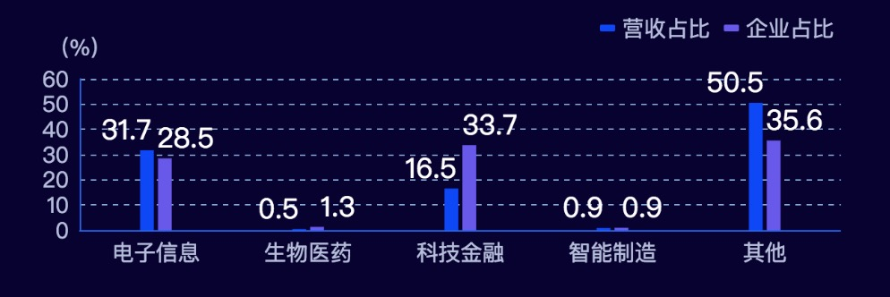

::: tip 概述
在日常开发中使用到的echart的一些理解，为了方便日后使用。
:::

## echart的属性对应的图表组件
### title 
基本不用，这是对应每个图表的标题，当需要把这个图表下载下来的时候才会用到。
### legand
图例组件，可以通过点击图例控制哪些系列不显示。比如如下的营收占比，
 -->
可以配置位置(left,top...)、宽高(width\height)、图例之间的距离(itemGap)、图例的宽高(itemWidth、itemHeight)、格式化图例(formatter)[等等](https://www.echartsjs.com/option.html#legend)<br>
### grid
grid可以是个数组对象，每个数组对象表示一个图表的配置，可以配置离容器的top、left，图表的宽高(默认是继承容器的宽高)
### rich
富文本，当你的X\Y轴需要加图片或一些css样式时，可以用到富文本，比如下图:红色标记的箭头是图片

```js
      xAxis: { // x坐标轴
        type: 'category',
        data: ['天使', 'T', 'A轮', 'T', 'B轮', 'T', 'C轮', 'T', 'D轮', 'T', 'E轮'],
        axisLabel: { // 文字
          textStyle: {
            color: '#b5bddb',
            fontSize: 20,
          },
          interval: 0, // 设置成 0 强制显示所有标签。
          formatter: function(value, index) {
            // 判断如果是下标为奇数时（也就是T）显示箭头
            if (index % 2 === 1) {
              return `{arrow|}`;
            } else {
              return value
            }
          },
          rich: {
            arrow: {
              width: 30,
              height: 10,
              align: 'center',
              backgroundColor: {
                image: arrowIcon,
              },
            },
          },
        },
```
### xAxis和yAxis
这是最常用的属性了，在一些柱状图和曲线图基本都有用到，最常用到的比如：<br>
``` html
name: 'string' => 坐标轴名称
nameLocation: ''start','middle' 或者 'center','end' => 坐标轴名称显示的位置
nameTextStyle: 'object' => 坐标轴名称的样式
nameGap: 'Number' => 坐标轴名称与轴线之间的距离。 Y轴的轴名与Y轴，看下图。
```

### series
系列列表。每个系列通过 type 决定自己的图表类型，每个type都有自己的对象。
## 曲线图例子


