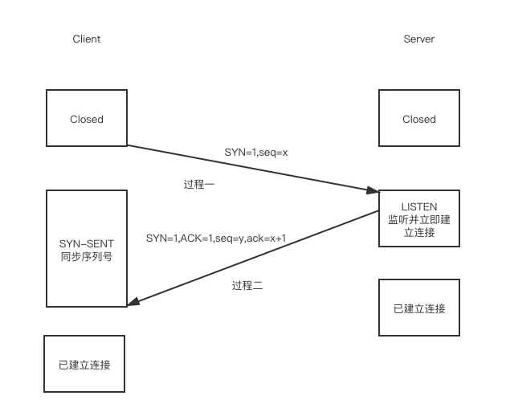

::: tip 概述
当遇到一些要死记的东西时会记在这边。
:::

## http
### 状态码
```js
const codeMessage = {
  200: '服务器成功返回请求的数据。',
  201: '新建或修改数据成功。',
  202: '一个请求已经进入后台排队（异步任务）。',
  204: '删除数据成功。',
  400: '发出的请求有错误，服务器没有进行新建或修改数据的操作。',
  401: '用户没有权限（令牌、用户名、密码错误）。',
  403: '用户得到授权，但是访问是被禁止的。',
  404: '发出的请求针对的是不存在的记录，服务器没有进行操作。',
  406: '请求的格式不可得。',
  410: '请求的资源被永久删除，且不会再得到的。',
  422: '当创建一个对象时，发生一个验证错误。',
  500: '服务器发生错误，请检查服务器。',
  502: '网关错误。',
  503: '服务不可用，服务器暂时过载或维护。',
  504: '网关超时。',
}
```
### http中的Cache-Control
::: tip
`Cache-Control`通用消息头字段被用于在http请求和相应中通过指定指令来实现缓存机制。缓存指令是单向的，这意味着在请求设置的指令，在相应中不一定包含相同的指令。
:::
有如属性：
`public`:表明响应可以被任何对象（包括：发送请求的客户端，代理服务器，等等）缓存。
`private`:表明响应只能被单个用户缓存，不能作为共享缓存（即代理服务器不能缓存它），可以缓存响应内容。
`no-cache`:在释放缓存副本之前，强制高速缓存请求提交给原始服务器进行验证
### 浏览器对于Cache-Control的响应
[https://blog.csdn.net/four_lemmo/article/details/78211520](https://blog.csdn.net/four_lemmo/article/details/78211520)
## placeholder样式的更改
```css
input::-webkit-input-placeholder, textarea::-webkit-input-placeholder {
color: #666;
}
input:-moz-placeholder, textarea:-moz-placeholder {
color: #666;
}
input::-moz-placeholder, textarea::-moz-placeholder {
color: #666;
}
input:-ms-input-placeholder, textarea:-ms-input-placeholder {
color: #666;
}
```
## Http Options Method
::: tip Option Method
OPTIONS请求方法的主要用途有两个：
1、获取服务器支持的HTTP请求方法；
2、用来检查服务器的性能。
3、域请求，检测是否是跨域
:::

## MutationObserver
::: tip MutationObserver API
Mutation Observer API 用来监视 DOM 变动。DOM 的任何变动，比如节点的增减、属性的变动、文本内容的变动，这个 API 都可以得到通知
:::
[api地址](https://wangdoc.com/javascript/dom/mutationobserver.html)

## npm
### 查看本地（该仓库）安装了哪些包
`npm list --depth=0`
### 查看全局（-g）安装了哪些包
`npm list --depth=0 --global`
### 安装包
`npm install xxx`
安装`xxx`模块到当前命令行所在的目录
`npm install -g xxx`
利用npm安装全局模块xxx
### 本地安装
::: tip
本地安装时将模块写入package.json中，方便别人install
:::
`npm install xxx`<br>
安装但不写入package.json<br>
`npm install xxx --save`<br>
安装并写入package.json的`dependencies`中<br>
`npm install xxx --save-dev`<br>
安装并写入package.json的`devDependencies`中<br>
### dependencies & devDependencies
`devDependencies`是只会在开发环境下依赖的模块，生产环境不会被打入包内<br>
`dependencies`依赖的包不仅开发环境能使用，生产环境也能使用
### 删除包
::: tip
删除本地模块时你应该思考的问题：是否将在package.json上的相应依赖信息也消除？
:::
`npm uninstall xxx`<br>
删除模块，但不删除模块留在package.json中的对应信息<br>
`npm uninstall xxx --save`<br>
删除模块，同时删除模块留在package.json中dependencies下的对应信息<br>
`npm uninstall xxx --save-dev`<br>
删除模块，同时删除模块留在package.json中devDependencies下的对应信息<br>
`npm uninstall xxx -g`
删除全局npm包
### npx
::: tip
npm v5.2.0引入的一条命令（npx），引入这个命令的目的是为了提升开发者使用包内提供的命令行工具的体验。
:::
🌰：
安装一个react app<br>
老方法:<br>
```js
npm install -g create-react-app
create-react-app my-app
```
用npx: <br>
```js
npx create-react-app my-app
```
这条命令会临时安装create-react-app包，命令完成后会自动删掉，不会出现在global中。下次再执行，还是会重新临时安装。
**使用npx查看当前项目的npm包的版本**
`npx xxx -v`
如果查看全局包的版本直接:`xxx -v`
### 依赖包版本号~、^、*
* ~会匹配最近的小版本依赖包，比如~1.2.3会匹配所有1.2.x版本，但是不包括1.3.0
* ^会匹配最新的大版本依赖包，比如^1.2.3会匹配所有1.x.x的包，包括1.3.0，但是不包括2.0.0
* *意味着安装最新版本的依赖包
### 配置指向源码
`npm config set registry https://registry.npmjs.org //配置指向源`
## JS模块化
### CommonJS
::: tip
同步模块加载，不适合网络请求
:::
新建say.js
```js
exports.blog = {
  say: function(){
    return 'say function'
  }
}
```
新建test.js
```js
let say = require('./say').blog
console.log(say.say()) // say function'
```
### AMD
::: tip
Asynchronous Module Definition(异步组件定义)，提前加载依赖
:::
### CMD
::: tip
Common Module Definition，AMD的优化版，依赖后置，使用时才加载，
RequireJS提供延迟加载功能
:::
### module.exports 、exports、export、export default的区别
`module.exports`和`exports`属于CommonJS模块规范，`module.exports`和`exports`导出模块，用require引入模块。

Node应用由模块组成，采用CommonJS模块规范。根据这个规范，每个文件就是一个模块，有自己的作用域。在一个文件里面定义的变量、函数、类、都是私有的，对其他文件不可见。

`export`和`export default`导出模块，import导入模块。

通过export方式导出，在导入时要加{ }，export default则不需要，使用export default命令，为模块指定默认输出，这样就不需要知道所要加载模块的变量名。

`export`导出
```js
export const str = 'hello world'  //变量

export function fuunc(a){ //函数
    return a+1
}
```
`对应的导入方式`
```js
import { str, func } from 'demo' //也可以分开写两次，导入的时候带花括号
```

`export default`
```js
export default const str = 'hello world'
```
`对应的导入方式`
```js
import str from 'demo1' //导入的时候没有花括号
```

## C# => 取num个在min - max的不重复随机数
```c#
///
    /// </summary>
    /// <param name="num"></param>
    /// <param name="min"></param>
    /// <param name="max"></param>
    /// <returns></returns>
    public static List<int> getRandomNumBetweenMinAndMax(int num, int min, int max)
    {
        List<int> result = new List<int>();
        bool flag;
        for (int i = 0; i < num;)
        {
            flag = true;
            System.Random ran = new System.Random();
            int n = ran.Next(min, max);
            foreach (int r in result)
            {
                if (r == n)
                {
                    flag = false;
                    break;
                }
            }
            if (flag)
            {
                result.Add(n);
                i++;
            }
        }
        return result;
    }
```
## js复制黏贴增加内容
```js
document.body.oncopy = function (e) {
		let text = getSelection() + "你要增加的内容"
		//clipboardData：剪贴板
		e.clipboardData.setData("text", text)
		e.preventDefault()
	}
```
## TCP/IP
::: tip
OSI七层模型对应过来TCP只有四层。
:::
| OSI七层模型       | 应用       | TCP/IP四层模型 |      应用      |
| -------------| --------------- | ------------- |:-------------:|
| 应用层、表示层、会话层| 表示层：ASCII         | 应用层         | http协议、FTP协议 |
| 传输层        | 防火墙         | 传输层         | tcp、udp      |
| 网络层        | 三层交换机         | 网络层         | 路由器      |
| 数据链路、物理层| 二层交换机和网卡、集线器         | 链路接口层      |      |
::: tip 二层交换机&三层交换机
二层交换机只有交换功能，而三层交换机因为是在第三层，所以具有交换功能和路由器的功能。
:::
* 物理层:负责在物理线路上传输原始额二进制数据；
* 数据链路层：负责在通信的实体间建立数据链路连接；
* 网络层：负责创建逻辑链路，以及实现数据包的分片和和重组，实现拥塞控制、网络互动等功能；
* 传输层：负责向用户提供端到端的通讯服务，实现流量控制以及差错控制；
* 会话层：定义何时开始、控制和结束一个会话，包括对多个双向消息的控制和管理，以便只完成连续消息的一部分可以通知应用，从而使得表示层看到的数据是连续的，某些情况下，如果表示层收到了所有的数据，则用数据代表表示层；
* 表示层：定义数据格式以及加密
* 应用层：为应用程序提供了网络服务

### TCP/IP协议
::: tip 概念
TCP/IP是一个协议簇，里面包括很多协议，例如：超文本协议(http)，文件传输协议(ftp)，TCP（Transmission Control Protocol 传输控制协议），UDP（User Datagram Protocol 用户数据报协议（无连接））
:::
### TCP&UDP
区别：
1. 基于连接与无连接
2. 对系统资源的要求（TCP较多，UDP少）
3. UDP程序结构简单
4. TCP流模式与UDP数据报模式
### 三次握手

### 四次挥手
::: tip 注意
没有client端和服务端之分，只有主动方与被动方，因为断开连接也可以是server端主动断开，但是连接肯定是client主动发送的。
:::

### 面试常见面试题:

::: tip 为什么不能用两次握手进行连接？
三次握手完成了两个重要的功能，既要双方做好发送数据的准备工作（双方都知道彼此已准备好），也要允许双方就初始序列号进行协商，这个序列号在握手过程中被发送和确认。

现在将三次握手改成两次握手，死锁是可能发生的。作为例子，考虑服务端S和客户端C之间的通信，假定C给S发送一个连接请求分组，S收到了这个分组，并发送了确认应答分组。按照两次握手的协定，S认为连接已经成功地建立了，可以开始发送数据分组。可是，在C在S的应答分组在传输中丢失的情况下，如果上图的过程二丢失，C将不知道S是否已准备好，不知道S建立什么样的序列号，C甚至怀疑S是否连接分组。在这种情况下，C认为连接还未建立成功，将忽略S发来的任何数据分组，只等待应答分组。而S在发出的分组超时后，重复发送同样的分组。这样就形成了死锁。
:::

::: tip 为什么连接的时候是三次握手，关闭的时候却是四次握手？
为当Server端收到Client端的SYN连接请求报文后，可以直接发送SYN+ACK报文。其中ACK报文是用来应答的，SYN报文是用来同步的。但是关闭连接时，当Server端收到FIN报文时，很可能并不会立即关闭SOCKET，因为TCP服务可能需要通知高层的应用程序，所以只能先回复一个ACK报文，告诉Client端，"你发的FIN报文我收到了"。只有等到我Server端所有的报文都发送完了，我才能发送FIN报文，因此不能一起发送。故需要四步握手。
:::

::: tip 如果已经建立了连接，但是客户端突然出现故障了怎么办？
TCP还设有一个保活计时器，显然，客户端如果出现故障，服务器不能一直等下去，白白浪费资源。服务器每收到一次客户端的请求后都会重新复位这个计时器，时间通常是设置为2小时，若两小时还没有收到客户端的任何数据，服务器就会发送一个探测报文段，以后每隔75秒钟发送一次。若一连发送10个探测报文仍然没反应，服务器就认为客户端出了故障，接着就关闭连接。
:::
详情点击[TCP的三次握手与四次挥手理解](https://blog.csdn.net/qq_38950316/article/details/81087809)
### https
::: tip https
HTTPS即加密的HTTP，HTTPS并不是一个新协议，而是HTTP+SSL（TLS）。原本HTTP先和TCP（假定传输层是TCP协议）直接通信，而加了SSL后，就变成HTTP先和SSL通信，再由SSL和TCP通信，相当于SSL被嵌在了HTTP和TCP之间
:::
### http1.0&&http1.1&&http2.0
**http1.0**
1945发布了[http1.0-RFC](https://tools.ietf.org/search/rfc1945)，1.0仅允许通过一个tcp连接发出一个请求。这引发了所谓的“线头阻塞”问题，迫使浏览器等待缓慢的响应。HTTP1.1通过管道解决了这个问题，管道使浏览器能并行发出多个请求。但是，浏览器供应商很难实现管道，而且大多数浏览器（包括Firefox）在发布时都默认禁用该特性。Chrome 甚至完全删除了它。

多个 TCP 连接

打开 TCP 连接需要很高的成本，而且我们对客户端应如何使用它们知之甚少。唯一的协议规定是，每个主机最多可以打开 2 个连接。由于只有 2 个 TCP 连接，开发人员为了能够展示一个现代页面需要竞争这两个名额 — 所以他们找到了一种方法来绕过这一限制。
**http1.1**
1. HTTP 1.1的持续连接，也需要增加新的请求头来帮助实现，例如，Connection请求头的值为Keep-Alive时，客户端通知服务器返回本次请求结果后保持连接；Connection请求头的值为close时，客户端通知服务器返回本次请求结果后关闭连接。HTTP 1.1还提供了与身份认证、状态管理和Cache缓存等机制相关的请求头和响应头。

当前多个接口同时访问时，http1.1中可以新建多个tcp，但是每个tcp只能一次访问一个接口，在http2.0中可以在一个tcp上面发送多个经过二进制分帧后的请求。
::: tip 注意
在HTTP/2 协议中， Connection 和 Keep-Alive  是被忽略的；在其中采用其他机制来进行连接管理
:::
2. HTTP 1.1增加host字段
**http2.0**
HTTP/2成功的关键在于，它实现了显著的性能改善，同时保持了HTTP范例，以及HTTP和HTTPS模式。该工作组规定，向HTTTP/2的迁移必须透明，而且使用者不会受到任何影响。

该协议最吸引人的特性包括：

1. 新升级路径 // 忽略
2. 二进制分帧
3. 请求/响应复用
4. 报头压缩
5. 流优先化
6. 服务器推送
7. 流控制

### 二进制协议
或许 HTTP/2 的最重要改变是转换为二进制协议。对于开发人员，这可以说是性能增强的焦点。新协议称为二进制分帧层（binary framing layer），它重新设计了编码机制，而没有修改方法、动词和标头的熟悉语义。

最重要的是，所有通信都在单个 TCP 连接上执行，而且该连接在整个对话期间一直处于打开状态。这可能得益于二进制协议将通信分解为帧的方式：这些帧交织在客户端与服务器之间的双向逻辑流中。

### 请求/响应复用
单一 TCP 连接的问题在于，一次只能发出一个请求，所以客户端必须等到收到响应后才能发出另一个请求。这就是 “线头阻塞” 问题。正如之前讨论的，典型的变通方案是打开多个连接；**每个请求一个连接。但是，如果可以将消息分解为更小的独立部分并通过连接发送，此问题就会迎刃而解。**

这正是 HTTP/2 希望达到的目标。将消息分解为帧，为每帧分配一个流标识符，然后在一个 TCP 连接上独立发送它们。此技术实现了完全双向的请求和响应消息复用。
详情看[http2.0详解](https://www.ibm.com/developerworks/cn/web/wa-http2-under-the-hood/index.html)
## DNS
它作为将域名与IP地址相互映射的一个分布式数据库，能够使人更方便地访问互联网。DNS使用TCP和UDP端口53
## get&&post
1. GET在浏览器回退时是无害的，而POST会再次提交请求的。
2. get 请求参数会被完整保留在浏览器历史记录里，而post中参数不会被保留
3. Get请求会被浏览器主动cache，而POST不会，除非手动设置。
4. GET请求是幂等的，意味着不论执行多少次，产生的效果和返回的结果都是一样的，客户端可以向服务器重复地发送GET请求而不会产生负面影响，反之，POST请求是非幂等的。
5. `get`产生一个`tcp`数据包，浏览器会把`http header`和`data`一并发送出去，服务器响应200（返回数据），`post`产生两个tcp数据包，浏览器会先发送header，服务器响应100 continue，浏览器再发送data，服务器响应200（返回数据）**(并不是所有浏览器都会在POST中发送两次包，Firefox就只发送一次)**
## 后端返回流下载
::: tip
正常情况下window.open可以解决下载问题，但是有时候要在请求头里面加参数，比如一些权限验证，就可以用下面的代码
:::
```js
const download = async (url, sessionId) => {
  const fileResponse = await axios.get(url, { headers: { authorization:  'token...'} })
  const blob = new Blob([fileResponse.data], { type: 'text/plain;charset=utf-8' })
  url = window.URL.createObjectURL(blob)
  const a = document.createElement('a')
  a.href = url
  a.download = ['fileName']
  a.click()
  window.URL.revokeObjectURL(url)
}
```
## 单线程与多线程
### 单线程
::: tip
单线程在执行程序时，所走的程序的路径按照连续排序排下来，前面的必须处理好，后面的才会执行。
:::
优点：同步应用程序的开发比较容易，但由于需要在上一个任务完成后才能开始新的任务，所以其效率通常比多线程应用程序低，如果完成同步任务所用的时间比预计时间长，应用程序可能不会响应。
### 多线程
::: tip
多线程开发可以将耗时操作放入子线程，将UI刷新加入主线程，防止页面卡顿。
:::
## 代理
### 前向代理
::: tip
前向代理:是一个位于客户端和原始服务器(origin server)之间的服务器，为了从原始服务器取得内容，客户端向代理发送一个请求并指定目标(原始服务器)，然后代理向原始服务器转交请求并将获得的内容返回给客户端。客户端才能使用前向代理。
:::
一般提到的前向代理。表面上客户端C可以直接访问服务器S，但实际上C在访问S的过程中经过了另一个中间的服务器M，M就是代理服务器。为什么说是正向代理？因为前向代理是面向客户端的，而不是服务器。M接收了C的请求后，（有选择的）对请求进行简化或者其他处理再向目标服务器请求数据。结合下面这一张图片。

对请求进行简化或者其他处理意味着可以无视某些请求，譬如：譬如：学校发现 abc.com 站点上的内容很黄很暴力，为了在校学生的身心健康，在学校的代理服务器上对 abc.com 做限制，于是学生就不能访问 abc.com 站点了，也可以说 abc.com 被和谐了。我们现在访问Google，一般来说也是访问不到的。
::: 前向代理的应用
1. 访问被和谐的站点，譬如FQ等
2. 隐藏客户端，真正与服务器打交道的是前向代理
3. 提高访问速度，前向代理的缓存功能
4. goagent 将 Google App Engine GAE 作为代理服务器中转，从而突破围墙。
:::
### 反向代理
::: tip
反向代理是服务器是代理服务器的一种。服务根据客户的请求，从其关联的一组或多组后端服务器上获取资源，然后再将这些资源返回给客户端，客户端只会得知反向代理的IP地址，而不知道在代理服务器后面的服务器簇的存在。反向代理是面向服务器，对于客户端C访问服务器S而言，好像A真的在访问S一样，其实真正的服务器是在S后面的M。这就是Nginx的反向代理和负载均衡的基本思想。
:::

::: 反向代理的应用
1. 负载均衡
2. 加速访问静态页面内容，和前向代理一样有缓存的功能
3. 隐藏真实服务器，客户端不知道真正的服务器是怎样的
:::
看下面一张CDN的图，反向代理可以说是CDN的一种实现原理。


##

## 单例模式
::: tip 应用实例
* windows是多进程多线程，在操作一个文件的时候，就不可避免地出现多个进程或线程同时操作一个文件的现象，所以所有文件的处理必须通过唯一的实例来进行。
* 一些设备管理器常常设计为单例模式，比如一个电脑有两台打印机，在输出的时候就要处理，不能两台打印机打印同一个文件。
:::
优点：

1. 在内存里只有一个实例，减少了内存的开销，尤其是频繁的创建和销毁实例
2. 避免对资源的多重占用

缺点： 没有接口，不能继承，与单一职责原则冲突，一个类应该只关心内部逻辑，而不关心外面怎么样来实例化的。


