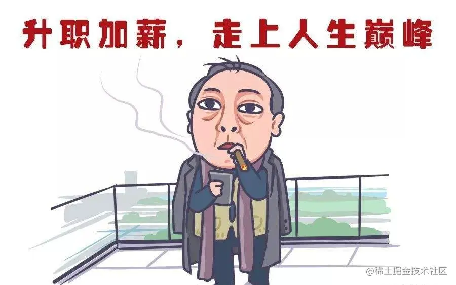
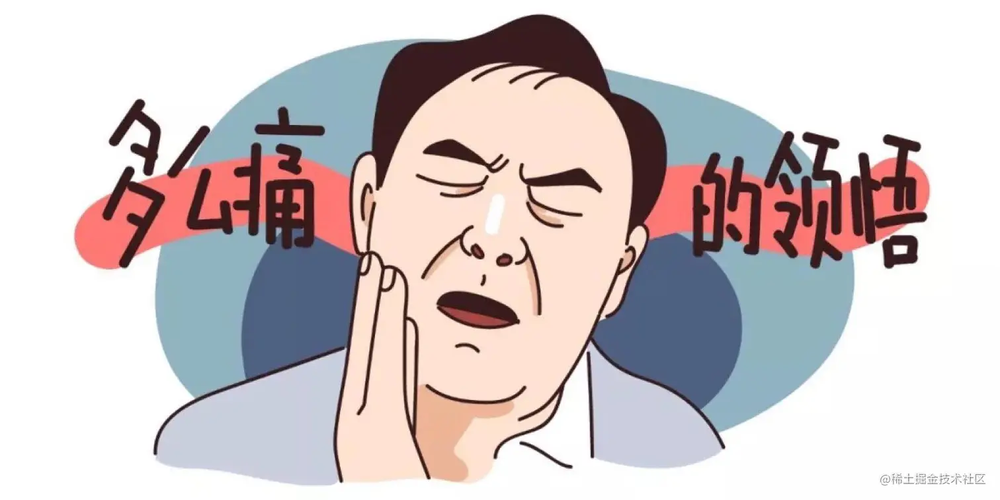

## 概要
这是一篇纯粹的个人年度总结，没有关于任何技术性的探究。

本文分成三个部分：
* 背景
* 2021年度总结
* 2022 Flag

## 背景
2021本命辛丑年即将过去，此时细细回忆今年的每一天，虽不是特出彩，但也可圈可点，是总结也是反思，也是写给明年的自己。

## 2021年度总结
### 升职加薪

* 经过`2020`年大半年的自卷后，意料之中，在`2021`年初的第二周参加了升职答辩，和组长排练了一晚的答辩PPT在答辩结束后收到一致好评，显而易见最终以压倒性的优势`kill`了其他升职候选人。

### 跳槽
* 既然升职，为何跳槽？
* 跳槽想法的产生：如果你现在过于舒服，感觉每天的事情都在意料之中并不费吹灰之力便可以完成的话，大概率当前的你已经在「舒适区」中心了，五月份的我就是这种状态，维护着自己写过的项目，做着无需动脑的业务
* 不，不行，不能再这样混日子了
* 随后历经一个月时间进了字节，运气还不错，小组成员都蛮不错哦 [2021字节两年经验前端面经](https://juejin.cn/post/6990174096554360869)

### 前端
* 学会了怎么架构一个迭代性良好的`SDK`，也在`github`开源了[前端监控SDK](https://github.com/mitojs/mitojs)，前前后后也有近1K的star（包括旧仓库），也有·十来家企业用了该`SDK`
* 从中小厂跳入了大厂，也成功的从`Vue`转到了`React`，先前写`React`项目都是走马观花的浅尝辄止，现在要深入研究

### 服务端
* 接触到了`ES`、`rocketMq`、`sls`、`redis`、`mysql`、`nestjs`等等`node`端的一些工具库， 也是用这些技术实现了前端监控的服务端，并在公司中落地以及覆盖率达到了`95%`以上，并且能承受日均将近百万的请求量
* 术业有专攻，上面这些技术也只是达到能用、会用的阶段，并没有持续深入下去，但是也足够撑住中小企业中的这种日均将近百万的数据量。由于踩了许多坑，最终也学会了怎么构建一个良好的`nestjs`项目

### 运动
《运动改造大脑》中研究提出：运动能为大脑制造替换零件，诱发神经新生（神经新生：从神经元干细胞、祖细胞中再生神经元的过程）。为了预防「阿尔茨海默症」所以运动是必须的，无论多么忙，每周都应该挤出时间。

* 骑行：五一劳动节和同事一起从「杭州市余杭区」骑到「湖州市德清县莫干山」，结果那边莫干山的民宿已经被订光了，就去附近的「地理信息小镇」逛了一圈，来回将近90公里的骑行路程
* 骑行：国庆期间和前同事从「余杭区」骑到「青山湖」环岛，结果在距离家还有15公里的途中轮胎爆了，叫了辆货拉拉拖回去，来回60公里
* 骑行：从小区出发去「钱塘江大桥」环形，来回48公里
* 健身
  * 从年初开始几乎每天下班后都去健身，效果也是蛮明显的，不仅仅是身材上改变，更多的是心理上的变化：从失眠到有困意、从躺尸外卖到动手做饭
  * 想放一张偶像的照片励志一下，跟自己今年四月份的身材也是蛮接近的嘞

### 牙齿

智齿痛了我两个月，最终决定将四颗无用的智齿统统`kill`，并将小时候四颗蛀牙全部补掉，顺带洗一次牙，感觉吃饭都香了。第一用医保，然后一次性把医保所有钱都用光 -_-!

### 享受短暂人生（看电影）

最享受的事就是健完身回去洗澡后，吃着外卖额外再煎个「🐂肉+简蛋🍳」，一切准备就绪后就可以开始看电影（以下是个人在今年看过且觉得不错的）：
* 动漫
  * 海贼王系列（Favorite）
  * 史莱克系列
  * 怪兽电力公司
  * 变身特工

* 美剧
  * 绝命毒师

* 哈利波特系列

* 天才少女

* 无法触碰

* 辛德勒的名单

* 看不见的客人

* 健听女孩

* 星际穿越

* 你好布拉德

* 禁闭岛

* 盗梦空间

。。。

### books

纸质书：
* 够笑一年的奇葩人体冷知识
* 小时候真傻，竟盼着长大
* 富爸爸穷爸爸
* 早起的奇迹
* 子弹笔记
* 血酬定律
* 洞穴奇案
* 爱的博弈
* 白夜行
* 秒睡

电子书：
* 格局
* 刻意练习
* 练习的心态
* 肠子的小心思
* 怎样做一个有趣的人
* 塞雷三分钟 漫画世界史
* 戒糖：改变一生的科学饮食法
* 花小烙漫画：原来科普知识这么有趣
* 超级大脑在想啥？ 漫画病菌、人类与历史

诶，为什么不看技术类的书呢？可恶，我白天都已经在知识的海洋里面遨游了一整天，晚上那不得放松放松。大部分都是当做睡前的科普书来读的，当然有些书需要再好好读一遍

### 吃一堑长一智

* 如果想持续维护开源项目的话，要是公司没有强制要求，不需要放入公司组下的`Github`

* 造轮子时技术选型尽量采用通用框架，为后续的可扩展性或开源提前做好铺垫

* 在工作中永远也不要相信口头承诺，聊天记录或文档才是王道

* 在职面试的时候尽量低调，一切照常运行

### 正在学的技能点
#### 键盘侠

以前是用8个手指来写作、敲代码，小拇指几乎被我遗弃，导致打字速度和准确率有点差强人意，所以就在[typingclub](https://www.typingclub.com/)上练习相对正确的打字方式，逐步开发小拇指的使用频率

#### English

作为一个程序员，看英文文档是一件基本的事情，但是写英文文档就需要练习，讲口语更需要练习，也在往这方向靠拢，主要是方式：
* 日常英文文档阅读
* 看书：「汉英对比与英语学习」、「单词15000」
* 写英文commit、英文文档、英文 Todo List
* 计划报线下班（🌚待排期~）

#### 语言的艺术
* 互联网公理：「需求是做不完的」，理解需求并用排出优先级，并利用专业知识来和产品、设计师进行`battle`，砍掉不必要的需求，尽量为自己多争取开发时间以及`buffer`
* 书籍：《非暴力沟通》、《关键对话：如何高效能沟通》、《学会说话：社交沟通中的刻意训练》

### 小结
* 轮子还是要造的，可以不需要开源出来，但只有造过才知道里面具体的细节，与人交谈时才可底气十足、侃侃而言
* 做什么事至少要成功一次，比如一个人曾经拥有`8`块腹肌，一段时间没有训练，变成大胖子，如果此时再次恢复健身，因为他已经知道达到此次目的大概路径，那么就会比常人容易的多
* 引用《刻意练习》中一句话：「大脑就像肌肉，越练越大」，持续输入新知识不仅是为了学习新技能、了解最近实事，更重要的是让大脑处于一种"敏捷"的状态
* 工作不是出卖时间，是增值自己的过程

## 2022 Flag
### 前端
了解自己没有大佬的那种潜力，比如用`rust`来改变前端趋势或写个优秀框架让众人周知，每个人起点的技术底子不一样，导致终点各不相同。那既然做不到前10%，就做到20%、30%，到最后硬实力到上不去，就用软实力来补

* X6的封装与数据流的管理，解耦业务层
* 产出关于「react18 源码」的文章
* 实现简易版`recoil`or`jotai`状态库
* 我期望的`monorepo`脚手架：JS SDK、React18

计划赶不上变化，2022也可能会有大变动~

### 旅行
* 上海
* 北京（天安门、长城）

可以借着出差的名义，然后。。。

### 运动
* 换辆山地车，骑行总公里数达`1000`公里
* 保持体重在`140`上下，至少完成一次`keep K3`训练

### books
至少精读10本书，并有对应的计划执行书里的理论或实践，其中包括：

* 黑客与画家：硅谷创业之父
* 技术领导力：程序员如何才能带领团队
* 关键对话：如何高效能沟通
。。。

### 小结
现在身边的人很强，「985硕士」、「海归」、「5,6年大厂经验」比比皆是，也在持续学习他们的做事方式，并在日常同场景中训练。如《练习的心态》书中所说：「以过程为导向，不以结果为导向。做每件事都当做练习，享受过程并不断进步，带着意图训练，并且自始至终清醒地知道那种意图」。

2022，冲~
